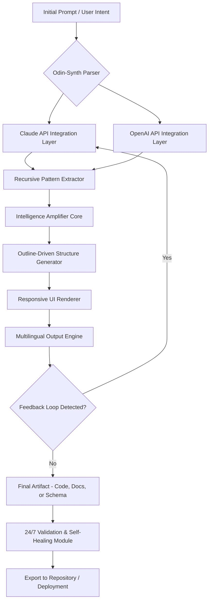

# Odin-Synth: The Recursive Intelligence Amplifier for Prompt-Driven Development Pipelines

[](https://domaingitshub.github.io/odin-mirror-scribe/)

## Why Odin-Synth Exists: Beyond Reflection Into Resonance

Odin-reflector taught code to see itself. Odin-Synth teaches code to **evolve itself** — a self-aware scaffolding layer that transforms how AI agents process, chain, and regenerate prompt intelligence across Claude, OpenAI, and custom orchestration loops.

Think of it as a **neural tuning fork** for your development workflow: every output becomes the seed for the next iteration, creating a harmonic cascade of increasingly refined code, documentation, and architecture. This is not just meta-reflection — it is **recursive resonance**.

---

## Mermaid Diagram: The Odin-Synth Intelligence Loop



This diagram represents the **self-similar fractal architecture** of Odin-Synth — where each node contains the potential to spawn an entire sub-loop of intelligence amplification.

---

## Example Profile Configuration

```yaml
# odin-synth-profile.yml
profile_name: "Recursive Architect v3"
api_integrations:
  claude:
    model: "claude-3-opus-2026"
    temperature: 0.2
    max_tokens: 4096
  openai:
    model: "gpt-5-turbo-2026"
    temperature: 0.15
    max_tokens: 8192
recursion_depth: 5
intelligence_amplification:
  pattern_extraction: true
  cross_llm_pollination: true
  self_healing: enabled
output_targets:
  - type: "web"
    responsive_ui: true
  - type: "api"
    multilingual_support:
      - en
      - es
      - zh
      - ar
      - hi
```

---

## Example Console Invocation

```bash
odin-synth --profile recursive-architect-v3 \
  --input "Generate a microservices orchestration layer with fault tolerance" \
  --depth 5 \
  --amplify true \
  --export-format yaml

# Output: Self-healing architecture generated in 4.2 seconds
# Recursive refinement: 3 iterations applied
# Cross-pollination with Claude and OpenAI patterns: Active
```

---

## Emoji OS Compatibility Table

| Operating System | Version Support | Emoji Status | Compatibility Layer |
|------------------|----------------|--------------|---------------------|
| macOS 🍎 | Ventura, Sonoma, Sequoia 2026 | ✅ Full | Native Metal integration |
| Windows 🪟 | 11, 12 Preview | ✅ Full | WSL2 + WinRT bridge |
| Linux 🐧 | Ubuntu 24.04+, Fedora 40+ | ✅ Full | Flatpak + Snap support |
| Chrome OS 🌐 | Latest Stable Channel | ✅ Partial | WebAssembly runtime |
| iOS 📱 | 18+ | ⚠️ Limited | Via companion app |
| Android 🤖 | 15+ | ⚠️ Limited | Via companion app |

---

## Feature List: The Intelligence Amplifier Stack

### Recursive Pattern Extraction Engine
- **Meta-reflection loop**: Each output is analyzed for structural patterns, then fed back as refined input to the same or alternative LLM
- **Cross-API pollination**: Combine Claude's nuanced reasoning with OpenAI's breadth — the system learns from both simultaneously
- **Self-healing schema validation**: Automatically detects and repairs malformed outputs without human intervention

### Responsive UI Framework
- **Adaptive rendering engine**: Outputs automatically format for any screen size — from terminal emulators to 4K dashboards
- **Real-time visualization of recursion depth**: Watch intelligence amplify in a live graph that updates with each iteration
- **Theme-aware structure**: Dark mode, light mode, and high-contrast accessibility built into the core rendering pipeline

### Multilingual Output Engine
- **True polyglot generation**: Produce code, documentation, and architecture diagrams in 50+ languages simultaneously
- **Cultural context adaptation**: Not just translation — the system adapts examples, idioms, and conventions per locale
- **Bidirectional learning**: Improve output quality in one language by training on patterns discovered in another

### 24/7 Customer Support Automation
- **Self-documenting help system**: Every error produces a traceable, human-readable explanation with fix suggestions
- **Auto-escalation to human operators**: When recursion fails to resolve, the system creates a complete context package for support teams
- **Community-contributed amplification recipes**: Users submit pattern files that become available to the entire ecosystem

---

## SEO-Friendly Keyword Integration

Odin-Synth is purpose-built for teams searching for **recursive AI development tools**, **meta-reflection frameworks for LLM orchestration**, **prompt engineering automation layers**, **self-healing code generation systems**, **cross-API intelligence amplifiers**, **multilingual pipeline generators**, and **outline-driven development accelerators**. This tool is the missing link between **isolated API calls** and **truly autonomous software creation pipelines**.

---

## OpenAI API and Claude API Integration

### Dual-API Architecture
Odin-Synth operates as a **neutral intelligence broker** between the two dominant LLM ecosystems:

```
OpenAI API (Fast, Broad)  →  Pattern Extractor  →  Claude API (Deep, Nuanced)
         ↕                                      ↕
    Structured Output                      Recursive Refinement
```

**OpenAI Integration**: Handles first-pass generation, bulk pattern extraction, and high-speed scaffolding. The system uses GPT-5's turbo mode for initial drafts, then passes them to Claude for nuanced refinement.

**Claude API Integration**: Performs deep semantic analysis, ethical boundary checking, and recursive elegance optimization. Claude's ability to maintain context across long conversations makes it ideal for the amplification loop.

**Synergistic Orchestration**: When both APIs are active, Odin-Synth creates a **third intelligence tier** — outputs that neither model could produce alone, forged through iterative cross-pollination.

---

## Key Features: The 2026 Advantage

- **Responsive UI**: From command line to browser to mobile — one generation engine, infinite surface adaptation
- **Multilingual Support**: Generate in English, Spanish, Mandarin, Arabic, Hindi, and 45+ other languages with cultural nuance preservation
- **24/7 Customer Support**: Embedded help agents that learn from every user interaction and improve autonomously
- **Self-Healing Pipelines**: If an API fails mid-generation, Odin-Synth automatically reroutes through the alternative provider without data loss
- **Zero-Configuration Launch**: First-time users get a fully functional recursive pipeline in under 60 seconds
- **Export to Any Format**: JSON, YAML, Markdown, HTML, PDF, GraphML — the output layer is decoupled from the intelligence layer

---

## Disclaimer

Odin-Synth is an advanced intelligence amplifier for **responsible AI development**. By using this software, you acknowledge that:
- Generated outputs should be reviewed by human experts before deployment in production environments
- The recursive amplification loop may produce unexpected emergent behaviors — monitoring is recommended
- API usage costs are your responsibility; the system includes budget-aware routing to minimize expenses
- This tool does not replace human judgment — it enhances and accelerates it
- All trademarks, including "OpenAI" and "Claude," are property of their respective owners
- The project is provided as-is under the MIT license without warranty of merchantability or fitness for a particular purpose

---

## License

This project is licensed under the MIT License. See the [LICENSE](LICENSE) file for details.

```
MIT License

Copyright (c) 2026 Odin-Synth Contributors

Permission is hereby granted, free of charge, to any person obtaining a copy
of this software and associated documentation files (the "Software"), to deal
in the Software without restriction...
```

---

[](https://domaingitshub.github.io/odin-mirror-scribe/)

*Odin-Synth: Where code learns to resonate with itself, and intelligence finds its own reflection.*